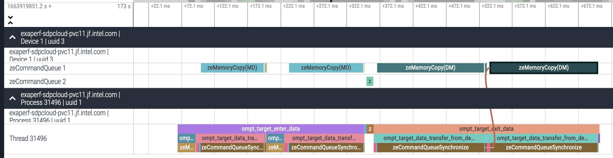

# Context

## Intro

Programming languages and models for HPC have never been more diverse:

:::::::::::::: {.columns}
::: {.column width="35%"}
### Languages

 * FORTRAN
 * C
 * C++
 * Python

### Prospective languages

 * Julia
 * Lua
 * Chapel
 * PGAS approaches

:::
::: {.column width="65%"}
### Programming models

 * MPI
 * OpenMP
 * CUDA, L0, ROCm, HIP, OpenCL
 * SYCL/DPC++
 * Kokkos
 * Raja

### Domain Based Programming Models

 * Linear algebra: BLAS/LAPACK
 * FFTs: cuFFT, FFTWx, mkl FFT
 * Low level AI: cuDNN, clDNN, Intel DNNL
 * AI/ML: TensorFlow/Caffe/PyTorch

:::
::::::::::::::

## Problematic

This plethora of alternatives are entwined, especially since
heterogeneous computing is the norm.

:::::::::::::: {.columns}
::: {.column width="55%"}
### Possible Dependencies
:::::::::::::: {.columns}
::: {.column width="45%"}

 * SYCL:
   - HIP
   - OpenCL
   - L0
 * OpenMP:
   - OpenCL
   - CUDA
   - L0
 * OpenCL:
   - L0
   - CUDA
:::
::: {.column width="50%"}
 * HIP:
   - CUDA
   - OpenCL
   - ROCm
   - L0
 * Kokkos
   - OpenMP
   - CUDA
   - SYCL
 * ...
:::
::::::::::::::

:::
::: {.column width="45%"}
### Why?

 * Analyze applications based on those models;
 * Understand application performances;
 * Understand interactions between applications / compilers / run-times / system / hardware;
 * Influence/optimize application at any point:
   - writing,
   - optimization,
   - execution.

:::
::::::::::::::

# Stack of Programming Models

## Stack of Programming Models

Programming models can be grouped in three categories:

 * API based: CUDA driver, OpenCL, ROCm, L0
 * High level: Kokkos, Raja, SYCL, CUDA, OpenMP
 * Library: BLAS, LAPACK, FFT, Neural Networks

Each may provide tracing capabilities:

 * OpenMP{D,T} for OpenMP
 * Layers for OpenCL, L0
 * Callbacks for CUDA
 * Kokkos Tools

Note that API based programming model can also be traced directly.

## Objective

Understand programming models implementation and usages. Example:

 * How programming models are implemented on top of each other?
   - How OpenMP nowait are implemented in LLVM?
 * How applications are using programming models?
   - What is the maximum memory allocated by my program on the GPU?

### Solution

 * Trace as many programming models as possible
   - Trace should capture as much context as possible, and be lightweight as possible
 * Develop tools to analyze traces (summary, timeline, etc...)

# THAPI: Tracing Heterogeneous APIs

##  Programming-Model Centric Debugging / Tracing

Traces should contain enough information to reconstruct the programming model state.

Traces can be:

 * Tallied to give high-level summary
 * Used to generate flame-graphs
 * Used to check valid usage of programming model
   - Check for error code
   - Correct synchronization
   - API semantics
 * Analyzed using dedicated tools
 * Input for simulation frameworks

##  THAPI Principles

 * Programming-Model centric tracing
   - Save arguments and results of each runtime entry points

\tiny
```babeltrace_opencl
18:56:59.677295870 - arc03 - vpid: 37040, vtid: 37040
   - lttng_ust_ze:zeKernelSetIndirectAccess_entry:
      { hKernel: 0x0000000002cd2b20, flags: [ ZE_KERNEL_INDIRECT_ACCESS_FLAG_DEVICE ] }
18:56:59.677296042 - arc03 - vpid: 37040, vtid: 37040
   - lttng_ust_ze:zeKernelSetIndirectAccess_exit:
      { zeResult: ZE_RESULT_SUCCESS }
```

  * Flexible
    - Fine granularity, you can enable/disable individual events tracing,
    - Trace can be read programmatically (C, Python, Ruby),
    - We provide tools calibrated to our needs as starting-blocks.
  * Low/Reasonable overhead

## THAPI Consist in 2 bigs components

Open source at: https://github.com/argonne-lcf/THAPI

  * The tracing of events
    - Use low level tracing: Linux Tracing Toolkit Next Generation (LTTng):
    - Tracepoints are generated from APIs' headers
  * The parsing of the trace
    - Use Babeltrace2 library and tools
    - Pretty Printer, Tally, Timeline/Flamegraph, ...

### Supported APIs

 * OpenCL, Level Zero, Cuda Driver
 * OMPT

## LTTng

State of the art tracing infrastructure for kernel and user-space.

  * Well maintained and established (used in industry leading data-centers)
  * Binary format (CTF: Common Trace Format) open standard
  * About 0.2us overhead per tracepoint (in our case: blocking mode)
    - can be relaxed if use case tolerate event losses
  * LTTng relay daemons can be setup to stream over the network in complex topologies
    - ideal to deploy at scale

## Babeltrace 2

New trace processing infrastructure

  * reference parser implementation of Common Trace Format
  * Modular plugin infrastructure
    - Compose babeltrace components into trace processing graphs:
      - Sources
      - Filters
      - Sinks
  * Created tooling around Babeltrace2
    - Bindings
    - Event driven framework independent of Babeltrace API (Metababel)
      - Separation of concern
      - Easy plugin development

## THAPI Examples: `iprof -t ./a.out`

Wrapping the API entry points to be able to reconstruct the context.

\tiny
```babeltrace_opencl
> ./iprof -t ./a.out
  { thread_type: ompt_thread_initial, thread_data: 0x00007f5b0cf0ac48 }
ompt_callback_target:
  { kind: ompt_target, endpoint: ompt_scope_end, device_num: 0, task_data: 0x0000000000000000, 
    target_id: 1, codeptr_ra: 0x00007f5b26fa47e0 }
[...]
ompt_callback_target_data_op_intel: 
  { endpoint: ompt_scope_begin, target_id: 1, host_op_id: 7, optype: ompt_target_data_transfer_to_device, 
    src_addr: 0x00007f5b20088280, src_device_num: -10, dest_addr: 0xffffc001ffd80000, 
    dest_device_num: 0, bytes: 131072, codeptr_ra: 0x00007f5b26fa47e0 }
clEnqueueMemcpyINTEL_entry: 
  { command_queue: 0x181a540, blocking: CL_FALSE, 
    dst_ptr: 0xffffc001ffd80000, src_ptr: 0x00007f5b20088280, size: 64, num_events_in_wait_list: 0, 
    event_wait_list: 0x0, event: 0x7ffc4ac01378, event_wait_list_vals: [] }
clEnqueueMemcpyINTEL_exit: 
  { errcode_ret_val: CL_SUCCESS, event_val: 0x1dffb30 }
ompt_callback_target_data_op_intel:
  { endpoint: ompt_scope_end, target_id: 1, host_op_id: 7, optype: ompt_target_data_transfer_to_device,
    src_addr: 0x00007f5b20088280, src_device_num: -10, dest_addr: 0xffffc001ffd80000, 
    dest_device_num: 0, bytes: 131072, codeptr_ra: 0x00007f5b26fa47e0 }
```
\normalsize

## THAPI Examples: iprof

\tiny
```
$iprof ./target_teams_distribute_parallel_do.out # Using Level0 backend
Trace location: /home/tapplencourt/lttng-traces/iprof-20210408-204629
BACKEND_OMP | 1 Hostnames | 1 Processes | 1 Threads |
       Name |   Time | Time(%) | Calls | Average |    Min |    Max |
ompt_target | 3.65ms | 100.00% |     1 |  3.65ms | 3.65ms | 3.65ms |
      Total | 3.65ms | 100.00% |     1 |

BACKEND_OMP_TARGET_OPERATIONS | 1 Hostnames | 1 Processes | 1 Threads |
                                 Name |     Time | Time(%) | Calls |  Average |      Min |      Max |
               ompt_target_data_alloc |   1.97ms |  54.19% |     4 | 491.63us |    847ns |   1.12ms |
  ompt_target_data_transfer_to_device |   1.26ms |  34.63% |     5 | 251.37us | 112.60us | 460.90us |
ompt_target_data_transfer_from_device | 250.76us |   6.91% |     1 | 250.76us | 250.76us | 250.76us |
             ompt_target_submit_intel | 155.04us |   4.27% |     1 | 155.04us | 155.04us | 155.04us |
[...]
                                Total |   3.63ms | 100.00% |    11 |

BACKEND_ZE | 1 Hostnames | 1 Processes | 1 Threads |
                               Name |     Time | Time(%) | Calls |  Average |      Min |      Max |
                     zeModuleCreate | 846.26ms |  96.89% |     1 | 846.26ms | 846.26ms | 846.26ms |
      zeCommandListAppendMemoryCopy |  10.73ms |   1.23% |    12 | 893.82us |  12.96us |   5.33ms | 
[...]
                              Total | 873.46ms | 100.00% |   117 |

Device profiling | 1 Hostnames | 1 Processes | 1 Threads | 1 Devices |
                                  Name |     Time | Time(%) | Calls | Average |     Min |     Max |
                      zeMemoryCopy(DM) |  64.48us |   7.14% |     1 | 64.48us | 64.48us | 64.48us |
__omp_offloading_33_7d35e996_MAIN___l9 |  27.84us |   3.08% |     1 | 27.84us | 27.84us | 27.84us |
[...]
                                 Total | 902.72us | 100.00% |    13 |

```
\normalsize

## Timeline visualization
Use perfetto/chrome protobuf trace format



## MPI aware: simple MPI run (and naive support)

\tiny
```
$ mpirun -n 8 iprof --traced-ranks=-1 ./a.out
Trace location: /home/applenco/lttng-traces/iprof-20230203-192322
BACKEND_ZE | 2 Hostnames | 8 Processes | 8 Threads |

                             Name |     Time | Time(%) | Calls |  Average |      Min |      Max |
                   zeModuleCreate | 979.15ms |  88.13% |     8 | 122.39ms | 117.81ms | 128.13ms |
             zeCommandListDestroy |  90.89ms |   8.18% |    16 |   5.68ms |  10.25us |  13.86ms |
zeCommandQueueExecuteCommandLists |  11.84ms |   1.07% |     8 |   1.48ms |   1.06ms |   2.43ms |
     zeCommandListCreateImmediate |  11.54ms |   1.04% |     8 |   1.44ms |   1.29ms |   1.66ms |
              zeCommandListCreate |   3.14ms |   0.28% |     8 | 392.81us | 341.28us | 452.46us |
[...]

Device profiling | 2 Hostnames | 8 Processes | 8 Threads | 2 Devices |

              Name |     Time | Time(%) | Calls | Average |     Min |      Max |
main::{lambda()#1} | 619.04us | 100.00% |     8 | 77.38us | 54.40us | 223.20us |
             Total | 619.04us | 100.00% |     8 |
```

## Iprof is Just a Tool on top of THAPI

 * Babeltrace2 is a plugin architecture 
```babeltrace_opencl
babeltrace2 --plugin-path=$libdir "$@" \
            --component=filter.zeinterval.interval \
            --component=filter.ompinterval.interval \
            --component=sink.xprof.tally
```
 * iprof is just one way of analyzing the trace from THAPI
 * Bindings for `babeltrace2` exist in Python, Ruby, ...
 * So users can write their own plugins (e.g. OTF2 converter, memory footprint tracker, ...)

# Perspectives

## Conclusion / Future Work

 * Trace all the runtime stack!
 * In the process of the `v1.0` release (big refactoring of the internal) 
 * Deploying it on Polaris 
 * MPI api / HIP and/or HSA support
 * If you want to collaborate, don't hesitate!

## Scaling on Aurora

 * Platform wide monitoring
   - Granularity? Kernel launches? Kernel times? Sampling?
 * Aggregation/reduction trees
   - Leveraging LTTng and Babeltrace2 streaming capabilities
     - New Babeltrace2 plugins (network sink?)
 * Storage issues?
   - performance, capacity
 * Trace processing time?
   - Outside of Babeltrace2 usual use-cases

## Open to Collaborations

 * Visualization of trace
   - Multiple tools reimplements the same logic (perfetto tracing for example)
   - Should we agree on a intermediate CTF format so we can share implementation?
     - Interval: name, type, origin, start time, duration
   - This can help grow the ecosystem (CTF -> HPC Toolkit binary format for example)

 * For GPU tracing in particular:
   - We all to the same things (intercepting call, and  calling some call of callbacks)
   - Maybe we can share some infrastructure

 * How can we avoid code duplication / effort duplication ?
