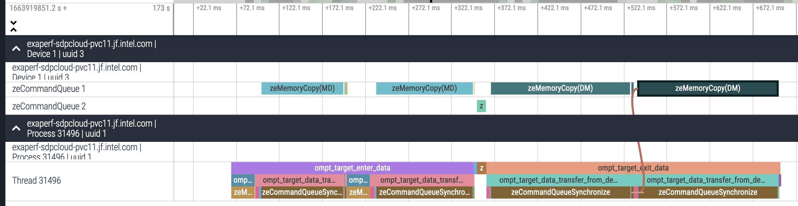

# Context

## Intro

We work with HPC applications that are highly parallel, distributed, but that also leverage accelerators such as GPUs.
Programming languages and models to implement these HPC applications have never been more diverse:

:::::::::::::: {.columns}
::: {.column width="35%"}
### Languages

 * FORTRAN
 * C
 * C++
 * Python

### Prospective languages

 * Julia
 * Lua
 * PGAS approaches

:::
::: {.column width="65%"}
### Programming models

 * MPI
 * OpenMP
 * CUDA, L0, ROCm, HIP, OpenCL
 * SYCL, Kokkos, Raja

### Domain Based Programming Models

 * Linear algebra: BLAS/LAPACK
 * FFTs: cuFFT, FFTWx, mkl FFT
 * Low level AI: cuDNN, clDNN, Intel DNNL
 * AI/ML: TensorFlow/Caffe/PyTorch

:::
::::::::::::::

## Problematic

This plethora of alternatives are entwined, especially since
heterogeneous computing is the norm.

### Possible Dependencies
:::::::::::::: {.columns}
::: {.column width="45%"}

 * SYCL:
   - HIP
   - OpenCL
   - L0
 * OpenMP:
   - OpenCL
   - CUDA
   - L0
 * OpenCL:
   - L0
   - CUDA
:::
::: {.column width="50%"}
 * HIP:
   - CUDA
   - OpenCL
   - ROCm
   - L0
 * Kokkos
   - OpenMP
   - CUDA
   - SYCL
 * ...
:::
::::::::::::::


<!---
## Stack of Programming Models

Programming models can be grouped in three categories:

 * API based: CUDA driver, OpenCL, ROCm, L0
 * High level: Kokkos, Raja, SYCL, CUDA, OpenMP
 * Library: BLAS, LAPACK, FFT, Neural Networks

Each may provide tracing capabilities:

 * OpenMP{D,T} for OpenMP
 * Layers for OpenCL, L0
 * Callbacks for CUDA
 * Kokkos Tools

Note that API based programming model can also be traced directly.
-->

## Objectives

### Introspect Applications and programming models

 * Analyze applications based on those models;
 * Understand application performances;
 * Understand interactions between applications / compilers / run-times / system / hardware;
 * Influence/optimize application at any point:
   - writing,
   - optimization,
   - execution.

### Examples

 * How programming models are implemented on top of each other?
   - How OpenMP nowait are implemented in LLVM?
 * How applications are using programming models?
   - What is the maximum memory allocated by my program on the GPU?

## Solution: Tracing

 * Trace as many programming models as possible
   - Trace should capture as much context as possible, and be lightweight as possible
 * Develop tools to analyze traces
   - Summary, timeline, etc...
 * Modular code architecture
   - Ease the implementation of new "front-end"
 * Solution needs to be efficient, robust, and scalable, but maybe not all at the same time :)
   - Capture millions of events per second per node;
   - Run for hours;
   - Up to 10,624 nodes.

# THAPI: Tracing Heterogeneous APIs

##  Programming-Model Centric Debugging / Tracing

Traces should contain enough information to reconstruct the programming model state.

Traces can be:

 * Tallied to give high-level summary
 * Used to generate flame-graphs
 * Used to check valid usage of programming model
   - Check for error code
   - Correct synchronization
   - API semantics
 * Analyzed using dedicated tools
 * Input for simulation frameworks

##  THAPI Principles

 * Programming-Model centric tracing
   - Save arguments and results of each runtime entry points

\tiny
```babeltrace_opencl
18:56:59.677295870 - arc03 - vpid: 37040, vtid: 37040
   - lttng_ust_ze:zeKernelSetIndirectAccess_entry:
      { hKernel: 0x0000000002cd2b20, flags: [ ZE_KERNEL_INDIRECT_ACCESS_FLAG_DEVICE ] }
18:56:59.677296042 - arc03 - vpid: 37040, vtid: 37040
   - lttng_ust_ze:zeKernelSetIndirectAccess_exit:
      { zeResult: ZE_RESULT_SUCCESS }
```

  * Flexible
    - Fine granularity, you can enable/disable individual events tracing,
    - Trace can be read programmatically (C, Python, Ruby),
    - We provide tools calibrated to our needs as starting-blocks.
  * Low/Reasonable overhead

## THAPI Consist in 2 bigs components

Open source at: https://github.com/argonne-lcf/THAPI

  * The tracing of events
    - Use low level tracing: Linux Tracing Toolkit Next Generation (LTTng):
    - Tracepoints are generated from APIs' headers
  * The parsing of the trace
    - Use Babeltrace2 library and tools
    - Pretty Printer, Tally, Timeline/Flamegraph, ...

### Supported APIs

 * OpenCL, Level Zero, Cuda Runtime/Driver, HIP
 * OMPT

## LTTng

State of the art tracing infrastructure for kernel and user-space.

  * Well maintained and established (used in industry leading data-centers)
  * Binary format (CTF: Common Trace Format) open standard
  * About 0.2us overhead per tracepoint (in our case: blocking mode)
    - can be relaxed if use case tolerate event losses
  * LTTng relay daemons can be setup to stream over the network in complex topologies
    - ideal to deploy at scale

## Automatic LTTng Tracepoint Generation

  * We trace all APIs entry points (OpenCL, CUDA, Level Zero,  HIP) or tracing callbacks (OMPT)
    - Tracing using interception library
    - We also support sampling of user-events
  * Tedious, error prone, and hard to maintain by hand
  * Automatic generation from headers or API description (OpenCL)
    - C99 parser => YAML intermediary representation
    - YAML + user provided meta information + user provided tracepoints => wrapper functions + Trace Model
    - Trace Model => tracepoints

## Example: cuDeviceGetCount

:::::::::::::: {.columns}
::: {.column width="50%"}
API model
\tiny
```YAML
- name: cuDeviceGetCount
  type:
    kind: custom_type
    name: CUresult
  params:
  - name: count
    type:
      kind: pointer
      type:
        kind: int
        name: int
```
:::

::: {.column width="50%"}
\normalsize

User provided meta-information

\tiny
```YAML


cuDeviceGetCount:
- [OutScalar, count]
```
:::
::::::::::::::

Interception

\tiny

```C
CUresult cuDeviceGetCount(int *count) {
  tracepoint(lttng_ust_cuda, cuDeviceGetCount_entry, count);
  CUresult _retval;
  _retval = CU_DEVICE_GET_COUNT_PTR(count);
  tracepoint(lttng_ust_cuda, cuDeviceGetCount_exit, count, _retval);
  return _retval;
}
```
\normalsize

Trace output (pretty):

\tiny

```babeltrace_opencl
21:03:53.070592532 - x3006c0s25b0n0 - vpid: 36056, vtid: 36056
   - lttng_ust_cuda:cuDeviceGetCount_entry: { count: 0x00007ffe93bec390 }
21:03:53.070593929 - x3006c0s25b0n0 - vpid: 36056, vtid: 36056
   - lttng_ust_cuda:cuDeviceGetCount_exit: { cuResult: CUDA_SUCCESS, count_val: 6 }
```

## Example: cuDeviceGetCount (Continued)

Trace Model:

\tiny
:::::::::::::: {.columns}
::: {.column width="50%"}

```YAML
- :name: lttng_ust_cuda:cuDeviceGetCount_entry
  :payload:
  - :name: count
    :cast_type: int *
    :class: unsigned
    :class_properties:
      :field_value_range: 64
      :preferred_display_base: 16
```
:::

::: {.column width="50%"}

```YAML
- :name: lttng_ust_cuda:cuDeviceGetCount_exit
  :payload: 
  - :name: cuResult
    :cast_type: CUresult
    :class: signed
    :class_properties:
      :field_value_range: 32
    :be_class: CUDA::CUResult
  - :name: count_val
    :cast_type: int
    :class: signed
    :class_properties:
      :field_value_range: 32
```
:::
::::::::::::::

\normalsize

Tracepoints:

\tiny

:::::::::::::: {.columns}
::: {.column width="50%"}

```C
TRACEPOINT_EVENT( 
  lttng_ust_cuda, 
  cuDeviceGetCount_entry, 
  TP_ARGS( 
    int *, count 
  ), 
  TP_FIELDS( 
    ctf_integer_hex(uintptr_t, count,
                    (uintptr_t)(count)) 
  ) 
)
```
:::

::: {.column width="50%"}

```C
TRACEPOINT_EVENT(
  lttng_ust_cuda,
  cuDeviceGetCount_exit,
  TP_ARGS(
    int *, count,
    CUresult, cuResult
  ),
  TP_FIELDS(
    ctf_integer(int32_t, cuResult, cuResult)
    ctf_integer(int, count_val, (count ? *count : 0))
  )
)
```
:::
::::::::::::::

## Babeltrace 2

  * Reference parser implementation of Common Trace Format
  * Modular plugin infrastructure
  * Compose Babeltrace 2 components into trace processing graphs:
    - Sources
    - Filters
    - Sinks

\tiny
```bash
babeltrace2 --plugin-path=$libdir \
            --component=filter.zeinterval.interval \
            --component=filter.ompinterval.interval \
            --component=sink.xprof.tally
```
\normalsize

  * THAPI Pipeline of plugins
    - Filters which aggregate messages
    - Sinks which create outputs:
      + Tally
      + Pretty Print
      + Timeline + Power monitoring
  * Automatic Plugins generation for Babeltrace 2 from the Trace Model


## Metababel

  * Problem: Writing Babeltrace 2 plugin by hand is tedious, error prone and hard to maintain.
    - Using Python bindings is too slow -> Use C or C++
  * Main Idea: Attaching User-Callbacks to Trace Events
  * Metababel generates Babeltrace 2 calls to read, write and dispatch events to User-Callbacks
    - Generate State Machine to handle Babeltrace 2 messages queues
  * Open Source: https://github.com/TApplencourt/metababel

## Metababel Example

Signature of callbacks for `cuDeviceGetCount_exit`:
\tiny
```C
typedef void cuDeviceGetCount_exit_callback_t(void *btx_handle, CUresult cuResult, int count_val);
```
\normalsize
Babeltrace 2 Code Generated (extract):
\tiny
```C
CUresult cuResult;
int count_val;
const bt_field *payload_field = bt_event_borrow_payload_field_const(bt_evt);
{
  const bt_field *_field = NULL;
  _field = bt_field_structure_borrow_member_field_by_index_const(payload_field, 0);
  cuResult = (CUresult)bt_field_integer_signed_get_value(_field);
}
{
  const bt_field *_field = NULL;
  _field = bt_field_structure_borrow_member_field_by_index_const(payload_field, 1);
  count_val = (int)bt_field_integer_signed_get_value(_field);
}
[...]
```
\normalsize
Example of user code:
\tiny
```C
#include <metababel/metababel.h>
void cuDeviceGetCount_exit_callback(void *btx_handle, CUresult cuResult, int count_val) {
  std::cout << "cuResult: " << cuResult << ", count_val: "  << count_val << std::endl;
}
void btx_register_usr_callbacks(void *btx_handle) {
  btx_register_cuDeviceGetCount_exit(btx_handle, &cuDeviceGetCount_exit_callback);
}
```

## Babeltrace 2 Ruby Binding

  - Plugins need to be fasts
  - But Bindings for fast prototyping or handling of Babeltrace 2 components graph is useful
  - Python is quite painful to package on HPC system
  - Developed Ruby Bindings (https://github.com/argonne-lcf/babeltrace2-ruby)

# THAPI Showcase

## THAPI Examples: `iprof -t ./a.out`

Wrapping the API entry points to be able to reconstruct the context.

\tiny
```babeltrace_opencl
> ./iprof -t ./a.out
  { thread_type: ompt_thread_initial, thread_data: 0x00007f5b0cf0ac48 }
ompt_callback_target:
  { kind: ompt_target, endpoint: ompt_scope_end, device_num: 0, task_data: 0x0000000000000000, 
    target_id: 1, codeptr_ra: 0x00007f5b26fa47e0 }
[...]
ompt_callback_target_data_op_intel: 
  { endpoint: ompt_scope_begin, target_id: 1, host_op_id: 7, optype: ompt_target_data_transfer_to_device, 
    src_addr: 0x00007f5b20088280, src_device_num: -10, dest_addr: 0xffffc001ffd80000, 
    dest_device_num: 0, bytes: 131072, codeptr_ra: 0x00007f5b26fa47e0 }
clEnqueueMemcpyINTEL_entry: 
  { command_queue: 0x181a540, blocking: CL_FALSE, 
    dst_ptr: 0xffffc001ffd80000, src_ptr: 0x00007f5b20088280, size: 64, num_events_in_wait_list: 0, 
    event_wait_list: 0x0, event: 0x7ffc4ac01378, event_wait_list_vals: [] }
clEnqueueMemcpyINTEL_exit: 
  { errcode_ret_val: CL_SUCCESS, event_val: 0x1dffb30 }
ompt_callback_target_data_op_intel:
  { endpoint: ompt_scope_end, target_id: 1, host_op_id: 7, optype: ompt_target_data_transfer_to_device,
    src_addr: 0x00007f5b20088280, src_device_num: -10, dest_addr: 0xffffc001ffd80000, 
    dest_device_num: 0, bytes: 131072, codeptr_ra: 0x00007f5b26fa47e0 }
```
\normalsize

## THAPI Examples: iprof

\tiny
```
$iprof ./target_teams_distribute_parallel_do.out # Using Level0 backend
Trace location: /home/tapplencourt/lttng-traces/iprof-20210408-204629
BACKEND_OMP | 1 Hostnames | 1 Processes | 1 Threads |
       Name |   Time | Time(%) | Calls | Average |    Min |    Max |
ompt_target | 3.65ms | 100.00% |     1 |  3.65ms | 3.65ms | 3.65ms |
      Total | 3.65ms | 100.00% |     1 |

BACKEND_OMP_TARGET_OPERATIONS | 1 Hostnames | 1 Processes | 1 Threads |
                                 Name |     Time | Time(%) | Calls |  Average |      Min |      Max |
               ompt_target_data_alloc |   1.97ms |  54.19% |     4 | 491.63us |    847ns |   1.12ms |
  ompt_target_data_transfer_to_device |   1.26ms |  34.63% |     5 | 251.37us | 112.60us | 460.90us |
ompt_target_data_transfer_from_device | 250.76us |   6.91% |     1 | 250.76us | 250.76us | 250.76us |
             ompt_target_submit_intel | 155.04us |   4.27% |     1 | 155.04us | 155.04us | 155.04us |
[...]
                                Total |   3.63ms | 100.00% |    11 |

BACKEND_ZE | 1 Hostnames | 1 Processes | 1 Threads |
                               Name |     Time | Time(%) | Calls |  Average |      Min |      Max |
                     zeModuleCreate | 846.26ms |  96.89% |     1 | 846.26ms | 846.26ms | 846.26ms |
      zeCommandListAppendMemoryCopy |  10.73ms |   1.23% |    12 | 893.82us |  12.96us |   5.33ms | 
[...]
                              Total | 873.46ms | 100.00% |   117 |

Device profiling | 1 Hostnames | 1 Processes | 1 Threads | 1 Devices |
                                  Name |     Time | Time(%) | Calls | Average |     Min |     Max |
                      zeMemoryCopy(DM) |  64.48us |   7.14% |     1 | 64.48us | 64.48us | 64.48us |
__omp_offloading_33_7d35e996_MAIN___l9 |  27.84us |   3.08% |     1 | 27.84us | 27.84us | 27.84us |
[...]
                                 Total | 902.72us | 100.00% |    13 |

```
\normalsize

## Timeline visualization
Use perfetto/chrome protobuf trace format



# Perspectives

## Conclusion / Future Work

 * Trace all the runtime stack!
 * In the process of the `v1.0` release (big refactoring of the internal) 
 * MPI api / HSA support

## Scaling on Exascale System (Aurora)

 * Platform wide monitoring
   - Granularity? Kernel launches? Kernel times? Sampling?
 * Aggregation/reduction trees
   - Leveraging LTTng and Babeltrace2 streaming capabilities
     - New Babeltrace2 plugins (network filter?)
 * Trace processing time?
   - Session Rotation
   - Non blocking

## Open to Collaborations

 * Currently collaborating with EfficiOS to improve performance of LTTng / Babeltrace for our use case.
 * Visualization of trace
   - Multiple tools reimplements the same logic (perfetto, TraceCompass, HPC Toolkit for example)
   - Should we agree on a intermediate CTF format so we can share implementation?
     - Interval: name, type, origin, start time, duration
   - This can help grow the ecosystem
  * Expend Metababel for more use-case

## Acknowledgement

This research was supported by the Exascale Computing Project (17-SC-20-SC), a collaborative effort of the U.S. Department of Energy (DOE) Office of Science and the National Nuclear Security Administration.

This research used resources of the Argonne Leadership Computing Facility, which is a DOE Office of Science User Facility supported under Contract DE-AC02-06CH11357.

